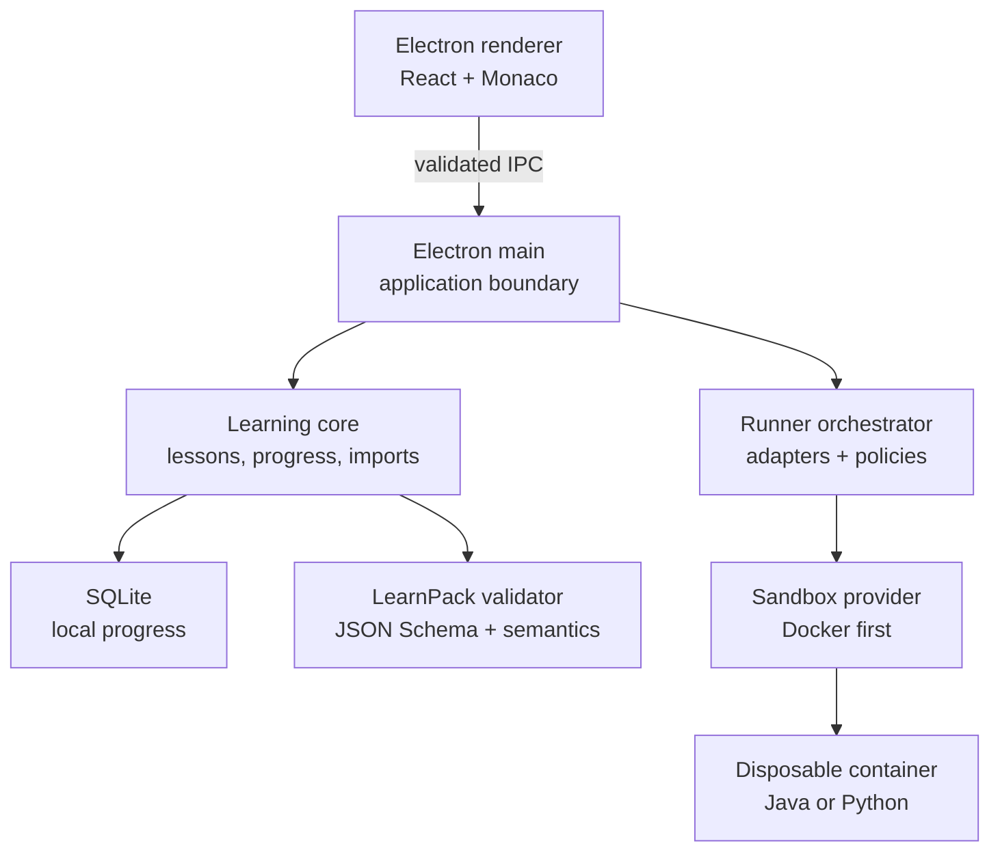

# LearnLocal — Full Project Plan

> Working title: **LearnLocal**  
> Product type: Offline-first, cross-platform programming-learning desktop application  
> Status: Architecture and implementation plan  
> Primary stack: Electron, React, TypeScript, Monaco Editor, SQLite, Docker/Podman-compatible runner  
> Initial target: Windows, macOS, and Linux

---

## 1. Executive summary

LearnLocal is a free, local-first application that lets a learner:

1. Choose a programming language and learning goal.
2. Generate a strict prompt for any AI assistant.
3. Ask that AI to produce a standardized course package.
4. Import the generated package into LearnLocal.
5. Study theory, examples, exercises, quizzes, debugging tasks, and real projects.
6. Write code in a VS Code-like editor.
7. Run the code locally in an isolated container.
8. Validate solutions against visible and hidden tests.
9. Receive progressive hints and track progress without an account or subscription.
10. Install, update, use, and remove multiple language runtimes independently.
11. Customize prompts, teaching style, editor behavior, runtime preferences, and per-language defaults.

The application is not tied to a particular AI provider. The AI generates content; LearnLocal validates, presents, executes, and tracks that content.

The core product definition is:

> **An open local runtime for portable, interactive programming courses.**

The project is technically feasible. The most important design work is concentrated in four areas:

- The versioned LearnPack course specification.
- The language-adapter interface.
- The boundary between Electron and the container engine.
- Safe and predictable lifecycle management for multiple language runtimes.

---

## 2. Key architecture decision: images are installed; containers are disposable

The user experience can say that a language environment is “installed,” but the implementation should distinguish between a Docker **image** and a Docker **container**.

- A language image contains the compiler/interpreter and the trusted LearnLocal harness.
- A container is an execution instance created from that image.

### Recommended lifecycle

When a user chooses Java for the first time:

1. LearnLocal checks whether Docker or another supported sandbox provider is available.
2. It pulls or builds the approved Java runtime image.
3. It verifies the image identity and adapter compatibility.
4. It creates a short-lived validation container.
5. It runs a small smoke test such as compiling and executing `Hello, LearnLocal`.
6. It deletes the validation container.
7. It records Java as an installed runtime.

When the learner presses **Run** or **Submit**:

1. LearnLocal creates a fresh, restricted container.
2. It injects only the current source files and trusted generated test harness.
3. It compiles and runs the code with network, time, memory, process, and filesystem limits.
4. It collects a normalized result.
5. It deletes the container and temporary workspace.

This provides the behavior the learner expects while avoiding permanent, stateful containers that can leak data between attempts.

### Optional warm-container optimization

A later version may keep one pre-created, stopped container per active language to reduce startup latency. This must be an optional performance feature, not the initial architecture. Warm containers must still be recycled frequently and never contain learner progress or secrets.

### What “Remove Java” means

The Runtime Manager should offer two levels:

- **Remove runtime:** remove Java containers, the Java image, compiler cache, and adapter-specific temporary data. Preserve imported courses, source projects, and learning progress.
- **Remove runtime and learning data:** additionally remove Java courses, saved project workspaces, attempts, and progress after explicit confirmation.

This distinction prevents a user from accidentally losing learning history simply because they need disk space.

---

## 3. Port strategy

### 3.1 Preferred design: no public port

Normal source execution does not require a TCP port.

```text
Electron Renderer
       │ restricted IPC
       ▼
Electron Main Process
       │ internal TypeScript API
       ▼
Runner Orchestrator
       │ Docker socket / Windows named pipe
       ▼
Ephemeral Sandbox Container
```

The renderer must never receive Docker socket access, container-engine credentials, or an unrestricted command API.

This approach has no port conflict and exposes no local web service.

### 3.2 When a local port is justified

A localhost port may be required if the runner becomes a separate sidecar process, if a browser-based companion is introduced, or if a course project intentionally runs a web server.

Use the following policy:

1. Bind only to `127.0.0.1` or `::1`, never `0.0.0.0` by default.
2. Default to automatic port allocation by binding to port `0` or asking Docker to publish to an ephemeral host port.
3. Let the operating system or container engine select an unused port.
4. Read the assigned port after startup and show it in the UI.
5. Protect any sidecar API with a randomly generated, per-launch authentication token.
6. Permit a user-selected port only in **Settings → Advanced → Runner**.
7. Preflight a custom port before launch.
8. If the custom port is occupied, offer:
   - Use an automatically selected port.
   - Choose another port.
   - Cancel startup.
9. Never silently terminate the process already using the requested port.

### 3.3 Ports for learner web projects

Web-development exercises are different from the internal runner.

- The trusted adapter defines which container port may be exposed, such as `3000` or `8080`.
- LearnLocal maps it to a random available host port.
- The preview is opened at a generated URL such as `http://127.0.0.1:49172`.
- The mapping exists only while the preview session is active.
- The container still has no general outbound network unless the exercise explicitly needs an allowlisted dependency-fetch stage.

The LearnPack must never be allowed to choose arbitrary host bindings.

---

## 4. Product principles

1. **Local-first:** course use, execution, and progress tracking work offline after required images and course packs are installed.
2. **Provider-independent:** ChatGPT, Claude, Gemini, local models, human teachers, or communities can create LearnPacks.
3. **Safe by construction:** course content declares intent; only trusted adapters produce executable commands and test harnesses.
4. **Portable:** a LearnPack can be copied, versioned, reviewed, and shared.
5. **Progressive:** lessons move from theory to small exercises, debugging, tests, mini-projects, and real projects.
6. **Inspectable:** users can see what runtime image, version, resource limit, and test mode an exercise uses.
7. **Recoverable:** removing a runtime does not remove progress unless the user explicitly chooses that option.
8. **Extensible:** languages and sandbox providers are plugins behind stable interfaces.
9. **Private by default:** no account, cloud sync, telemetry, or AI API key is required.
10. **Beginner-friendly:** container complexity is hidden behind clear setup and repair flows.

---

## 5. Scope

### 5.1 Version 1 scope

| Area | V1 decision |
|---|---|
| Desktop | Electron |
| UI | React + TypeScript |
| Editor | Monaco Editor |
| Storage | SQLite |
| Content | LearnPack 1.0 |
| Validation | JSON Schema Draft 2020-12 plus semantic validation |
| Sandbox | Docker provider |
| Languages | Java 21 and Python 3.x |
| Exercises | Output, function, debugging, multiple-choice, project checkpoints |
| Tests | Visible and hidden declarative tests |
| Hints | Ordered progressive hints |
| Projects | Mini-projects and one milestone project per course section |
| AI integration | External prompt generator and import flow |
| Customization | Typed settings, scoped profiles, editable prompt templates, import/export |
| Accounts | None |
| Cloud | None |
| Runtime management | Install, repair, update, remove, disk-usage view |

### 5.2 Explicit non-goals for V1

- Running arbitrary AI-generated shell commands.
- Supporting every programming language immediately.
- Cloud accounts, leaderboards, or social features.
- Collaborative real-time coding.
- Mobile execution.
- Public marketplace with unreviewed executable extensions.
- Automatic installation of Docker without explicit user consent.
- Perfect protection against malicious code on every host configuration.
- Kubernetes or remote multi-user execution.

---

## 6. Primary user journeys

### 6.1 First launch

1. Welcome screen explains that learning data stays on the device.
2. Environment check detects Docker Desktop, Docker Engine, or compatible provider.
3. If missing, the user receives platform-specific installation guidance.
4. LearnLocal verifies engine connectivity and security capabilities.
5. The user selects a storage location or accepts the application-data default.
6. The app offers Java and Python as installable runtimes.

### 6.2 Create a personalized course

1. User selects a language.
2. User selects current experience level.
3. User selects goals, topics, daily time, desired duration, and project preference.
4. Optional free-text instructions allow requirements such as “focus on Spring Boot” or “skip basic algorithms.”
5. LearnLocal generates a complete AI prompt containing LearnPack constraints and schema instructions.
6. User copies the prompt into any AI.
7. User imports the returned JSON or `.learnpack` file.
8. Importer validates the pack and displays warnings or errors.
9. User reviews the curriculum and starts learning.

### 6.3 Install a second language

1. User opens **Languages**.
2. User chooses Python while keeping Java installed.
3. LearnLocal estimates download size and final disk usage.
4. The app pulls and validates the Python image.
5. Both Java and Python appear as installed and can be used independently.

### 6.4 Run an exercise

1. User reads the lesson and opens the exercise.
2. Starter code opens in Monaco.
3. User presses **Run**.
4. Visible tests run in a disposable container.
5. Compile output, runtime output, duration, and visible assertions appear.
6. User requests hints if needed.
7. User presses **Submit**.
8. Visible and hidden tests run.
9. Progress is updated only if submission criteria are satisfied.

### 6.5 Remove a language runtime

1. User opens **Settings → Languages and Storage**.
2. User sees image size, cache size, active sessions, and last-used date.
3. User selects **Remove runtime**.
4. App stops and removes only containers labeled as owned by LearnLocal and associated with that runtime.
5. App removes the runtime image and cache.
6. Courses and progress remain available but show **Runtime required to run code**.
7. The runtime can be reinstalled later without losing progress.

---

## 7. System architecture



### 7.1 Trust boundaries

| Component | Trust level | May execute commands? | May access Docker? |
|---|---:|---:|---:|
| Electron renderer | Low | No | No |
| Imported LearnPack | Untrusted | No | No |
| Learner source code | Hostile by assumption | Only inside sandbox | No |
| Electron main | Trusted | Controlled internal operations | Through runner only |
| LearnPack validator | Trusted | No | No |
| Language adapter | Trusted, shipped with app | Creates allowlisted command definitions | Indirectly |
| Runner orchestrator | Highly trusted | Yes, constrained | Yes |
| Container engine | Highly privileged | Yes | Native |

### 7.2 Major components

#### Desktop shell

- Application windows and native menus.
- File import/export dialogs.
- Auto-update integration.
- Safe IPC bridge.
- Deep-link and file-association handling for `.learnpack`.

#### Learning UI

- Dashboard.
- Course outline.
- Lesson reader.
- Code editor.
- Test results.
- Hint panel.
- Project workspace.
- Progress and mastery views.
- Runtime Manager.

#### LearnPack subsystem

- ZIP/package reader.
- Path-safety validation.
- JSON Schema validation.
- Semantic validation.
- Compatibility checker.
- Import preview.
- Course-version migration.

#### Runner subsystem

- Language-adapter registry.
- Sandbox-provider registry.
- Workspace builder.
- Test-harness generator.
- Container lifecycle controller.
- Timeout and cancellation controller.
- Output parser and normalizer.
- Runtime installation and removal manager.

#### Persistence subsystem

- SQLite migrations.
- Repository layer.
- Attempt history.
- Progress calculations.
- Settings.
- Runtime inventory.
- Course and workspace metadata.

---

## 8. Proposed repository structure

```text
learnlocal/
├── apps/
│   └── desktop/
│       ├── electron/
│       │   ├── main.ts
│       │   ├── preload.ts
│       │   ├── ipc/
│       │   ├── windows/
│       │   └── security/
│       └── renderer/
│           ├── app/
│           ├── components/
│           ├── features/
│           │   ├── onboarding/
│           │   ├── dashboard/
│           │   ├── courses/
│           │   ├── lessons/
│           │   ├── editor/
│           │   ├── exercises/
│           │   ├── projects/
│           │   ├── progress/
│           │   ├── prompt-generator/
│           │   ├── settings/
│           │   └── runtimes/
│           └── styles/
├── packages/
│   ├── contracts/
│   │   ├── ipc.ts
│   │   ├── execution.ts
│   │   └── errors.ts
│   ├── learnpack/
│   │   ├── schema/
│   │   ├── parser/
│   │   ├── validator/
│   │   ├── migrations/
│   │   └── fixtures/
│   ├── learning-core/
│   ├── prompt-generator/
│   ├── settings-core/
│   ├── database/
│   │   ├── migrations/
│   │   ├── repositories/
│   │   └── backup/
│   ├── runner-core/
│   │   ├── orchestrator/
│   │   ├── policy/
│   │   ├── workspace/
│   │   ├── lifecycle/
│   │   └── results/
│   ├── sandbox-docker/
│   ├── runner-java/
│   ├── runner-python/
│   └── testing-utils/
├── runtime-images/
│   ├── java-21/
│   └── python-3/
├── learnpack-spec/
│   ├── specification.md
│   ├── schema/
│   ├── examples/
│   └── conformance-tests/
├── docs/
│   ├── architecture/
│   ├── security/
│   ├── adapters/
│   └── contributing/
├── scripts/
└── package.json
```

Use a monorepo so shared contracts, adapters, schema, and UI can evolve in one versioned repository.

---

## 9. LearnPack 1.0 specification

### 9.1 Package format

A `.learnpack` is a ZIP archive with a fixed layout and strict path rules.

```text
java-zero-to-intermediate.learnpack
├── manifest.json
├── content/
│   ├── 01-basics.json
│   ├── 02-variables.json
│   └── 03-control-flow.json
├── projects/
│   ├── calculator.json
│   └── todo-cli.json
├── assets/
│   ├── variables.svg
│   └── flowchart.png
└── checksums.json
```

### 9.2 Manifest example

```json
{
  "format": "learnpack",
  "schemaVersion": "1.0.0",
  "id": "java-zero-to-intermediate",
  "version": "1.0.0",
  "course": {
    "title": "Java: Zero to Intermediate",
    "description": "A project-based Java course.",
    "language": "java",
    "languageVersion": "21",
    "level": "beginner",
    "estimatedHours": 35,
    "authors": [{ "name": "AI-generated for local use" }]
  },
  "runtime": {
    "adapter": "java",
    "adapterRange": ">=1.0.0 <2.0.0",
    "runtimeVersion": "21"
  },
  "modules": [
    "content/01-basics.json",
    "content/02-variables.json",
    "content/03-control-flow.json"
  ],
  "projects": [
    "projects/calculator.json",
    "projects/todo-cli.json"
  ]
}
```

### 9.3 Exercise example

```json
{
  "id": "java-arrays-sum",
  "type": "function",
  "title": "Sum an Array",
  "instructionMarkdown": "Return the sum of every number in the array.",
  "starterFiles": [
    {
      "path": "Solution.java",
      "content": "public class Solution {\n  public static int sum(int[] values) {\n    // TODO\n  }\n}"
    }
  ],
  "entrypoint": {
    "kind": "function",
    "className": "Solution",
    "name": "sum",
    "parameters": [{ "name": "values", "type": "int[]" }],
    "returns": "int"
  },
  "tests": [
    {
      "id": "public-basic",
      "visibility": "public",
      "arguments": [[1, 2, 3]],
      "expected": 6
    },
    {
      "id": "hidden-negative",
      "visibility": "hidden",
      "arguments": [[-2, 5, 10]],
      "expected": 13
    }
  ],
  "hints": [
    "Create a variable for the running total.",
    "Visit every element with a loop.",
    "Add the current element to the total."
  ],
  "limits": {
    "timeoutMs": 3000,
    "memoryMb": 256,
    "maxOutputKb": 64
  }
}
```

### 9.4 Exercise types

| Type | Purpose | V1 |
|---|---|---:|
| `output` | Run a complete program and compare stdout | Yes |
| `function` | Invoke a function/method with typed arguments | Yes |
| `debug` | Repair supplied broken code | Yes |
| `multipleChoice` | Validate conceptual understanding | Yes |
| `fillCode` | Complete a constrained code fragment | Later |
| `project` | Multi-file project with checkpoints | Yes |
| `webPreview` | Run and preview a local web application | Later |
| `sql` | Execute queries against a seeded database | Later |

### 9.5 Declarative tests only in V1

LearnPack 1.0 must not contain:

- Shell commands.
- Docker options.
- Container image names.
- Host paths.
- Arbitrary test scripts.
- Package-manager commands.
- Network destinations.
- Privilege or capability requests.

The pack declares arguments, expected results, comparison mode, and limits within allowed ranges. The trusted language adapter converts these declarations into a test harness.

### 9.6 Two-stage validation

#### Structural validation

JSON Schema verifies required fields, types, enum values, string limits, and object shapes.

#### Semantic validation

Application code verifies facts that JSON Schema cannot fully guarantee:

- Every referenced file exists inside the archive.
- No archive path escapes the import directory.
- IDs are unique.
- Module ordering has no dependency cycle.
- Runtime adapter and language agree.
- Types are supported by the selected adapter.
- Test IDs are unique.
- Limits fall inside application policy.
- Asset MIME type and size are allowed.
- Total expanded archive size is safe.
- The pack does not contain symlinks or executable host files.

### 9.7 Import states

```text
selected → unpacking → structural validation → semantic validation
         → compatibility check → preview → imported
```

Failures must identify the file, JSON path, error code, and suggested correction.

---

## 10. AI prompt generator

### 10.1 Inputs

- Language and desired runtime version.
- Current experience.
- Goals.
- Topics to include.
- Topics to skip.
- Time per day.
- Target duration.
- Preferred balance: theory, practice, projects, interview exercises.
- Desired project themes.
- Accessibility and explanation preferences.
- Optional custom instructions.

### 10.2 Generated prompt sections

1. Role and learning objective.
2. Learner profile.
3. Curriculum design requirements.
4. Required exercise distribution.
5. Project requirements.
6. Hint rules.
7. Visible/hidden test rules.
8. LearnPack schema and allowed values.
9. Security prohibitions.
10. Output rules.
11. Self-checklist for the AI before it returns the pack.

### 10.3 Reliability strategy

Large courses may exceed an AI response limit. Support three generation modes:

- **Single-file starter course:** small course returned as one JSON document.
- **Manifest-first generation:** AI returns the outline and manifest, then the user generates modules one at a time.
- **Folder generation:** AI or local script produces all files and packages them into `.learnpack`.

The recommended mode for a full course is manifest-first because each module can be validated independently.

### 10.4 Import repair loop

When validation fails, LearnLocal should generate a repair prompt containing:

- The original schema version.
- Only the relevant validation errors.
- The affected file or object.
- A request to return corrected JSON without unrelated changes.

This keeps LearnLocal AI-independent while making almost-correct content easy to repair.

---

## 11. Settings and customization system

LearnLocal should be highly customizable, but it must separate **user preferences** from **security policy**. A user should be able to change how the application teaches, looks, generates prompts, stores data, and presents results. A setting must not make it possible for a course file or renderer compromise to obtain privileged container access.

### 11.1 Settings principles

1. Useful preferences are exposed in the interface instead of hidden in configuration files.
2. Every setting has a safe, documented default.
3. Settings are searchable.
4. Changed settings can be reset individually, by category, or globally.
5. Settings can be exported and imported without including progress or source code unless explicitly selected.
6. Advanced settings are clearly separated from normal learner preferences.
7. Invalid imported values are rejected or migrated, never silently accepted.
8. Course packs may suggest preferences but cannot silently change global settings.
9. Security-critical rules remain application-controlled.
10. Per-language profiles are supported because good Java defaults may not be good Python defaults.

### 11.2 Settings precedence

Resolve customizable values in this order, from lowest to highest priority:

```text
built-in application default
    ↓
global user setting
    ↓
language-profile setting
    ↓
course-specific user setting
    ↓
temporary session override
```

The UI should show where the effective value came from and provide **Reset to inherited value**. LearnPack suggestions sit beside this chain and require explicit user approval before becoming course-specific settings.

### 11.3 Settings categories

#### General

- Application language.
- Start page.
- Launch behavior.
- Reopen last course.
- Confirmation preferences for reversible operations.
- Update-check behavior.
- Diagnostics logging level.

#### Appearance and accessibility

- Light, dark, or system theme.
- Interface scale.
- UI font size.
- Lesson text width and line height.
- Reduced motion.
- High contrast.
- Color-blind-friendly result indicators.
- Screen-reader announcements.
- Editor and interface fonts.

#### Learning defaults

- Default experience level.
- Daily study target.
- Preferred session length.
- Theory/practice/project balance.
- Explanation depth.
- Preferred analogy frequency.
- Whether new concepts require a knowledge check.
- Default number of exercises per concept.
- Default number and reveal policy of hints.
- Whether solutions become available after attempts, time, completion, or never.
- Project frequency.
- Difficulty progression speed.
- Interview-preparation emphasis.
- Preferred real-world project themes.

#### Prompt defaults

- Default course-generation prompt.
- Manifest-generation prompt.
- Module-generation prompt.
- Project-generation prompt.
- Validation-repair prompt.
- “Explain my error” prompt.
- “Give me another exercise” prompt.
- “Make this easier/harder” prompt.
- Default custom instructions appended to every generated prompt.
- Preferred AI output mode: single JSON, manifest-first, or folder/package.
- Default AI provider label for copy instructions; this is presentation only and does not create a dependency.
- Whether to include the full schema, a compact schema, or a schema reference bundle.

#### Editor

- Theme and font.
- Font size and line height.
- Tab size and spaces/tabs.
- Word wrap.
- Minimap.
- Line numbers.
- Bracket-pair colorization.
- Format-on-save.
- Autosave delay.
- Vim or standard keybindings if supported.
- Per-language formatter preference from an application-approved list.
- Whether starter code comments are shown.

#### Execution and feedback

- Run before Submit requirement.
- Automatically open test results.
- Show execution duration.
- Show memory use when available.
- Stop execution when the first visible test fails.
- Maximum concurrent executions within a safe application cap.
- Default timeout and memory preference within policy bounds.
- Console font and maximum visible history.
- Compile diagnostics display style.
- Whether successful test details are collapsed.

#### Runtimes and storage

- Preferred sandbox provider when several are installed.
- Runtime update behavior: notify, manual, or automatic after confirmation.
- Storage location for courses, projects, and caches.
- Maximum cache size.
- Automatic cleanup age for disposable resources.
- Keep or remove unused runtime layers.
- Default runtime version per language from supported versions.
- Optional warm-container mode.
- Number of warm containers, capped by policy.
- Show disk-size estimates before install.

#### Ports and local previews

- Automatic host-port selection by default.
- Optional preferred custom port for a trusted sidecar.
- Preferred port range for learner web previews.
- Automatically open preview in the system browser.
- Preview session idle timeout.
- Port-conflict fallback behavior: ask, select automatically, or cancel.

Ports must still bind to loopback by default. A user preference cannot let an imported LearnPack publish an arbitrary interface or host port.

#### Privacy, backups, and data

- Optional anonymous diagnostics consent, if diagnostics are ever introduced.
- Crash-report consent.
- Backup frequency and retention count.
- Backup destination.
- Include or exclude source workspaces from backups.
- Clear attempt history without deleting completion state.
- Export settings, progress, or complete local data.
- Default behavior for metadata embedded in exported packs.

#### Notifications

- Runtime-install completion.
- Long project-test completion.
- Study reminders if the desktop platform permits them.
- Runtime updates.
- Low disk space.
- Backup failures.

#### Keyboard shortcuts

- Run.
- Submit.
- Cancel execution.
- Reveal next hint.
- Open command palette.
- Navigate lesson/exercise.
- Toggle console.
- Format document.

Shortcut conflicts must be detected before saving.

### 11.4 Custom prompt-template system

Default prompts should not be a single unstructured text field. Use named, versioned templates with supported variables.

Recommended built-in templates:

```text
course.full
course.manifest
course.module
course.project
course.repair
exercise.additional
exercise.explain-error
exercise.adjust-difficulty
```

Each built-in template can be:

- Viewed.
- Duplicated into a custom template.
- Edited after duplication.
- Selected as a default globally or for one language.
- Previewed with sample values.
- Validated for missing required placeholders.
- Exported and imported.
- Reset to the latest built-in version.

Keep the immutable built-in template and the user's custom copy separate so application updates never overwrite user work.

### 11.5 Prompt variables

Use explicit placeholders rather than arbitrary executable expressions.

```text
{{language.id}}
{{language.version}}
{{learner.level}}
{{learner.goals}}
{{learner.customInstructions}}
{{course.estimatedWeeks}}
{{course.minutesPerDay}}
{{course.topics.include}}
{{course.topics.exclude}}
{{course.projectThemes}}
{{learnpack.schemaVersion}}
{{learnpack.schema}}
{{validation.errors}}
```

The template engine should support escaped text, simple conditionals, and list iteration only if needed. It must not evaluate JavaScript, shell commands, filesystem paths, or network requests.

### 11.6 Prompt-template record

```ts
interface PromptTemplate {
  id: string;
  key: string;
  name: string;
  scope: "builtin" | "global" | "language" | "course";
  scopeId: string | null;
  templateVersion: number;
  basedOnTemplateId: string | null;
  content: string;
  requiredVariables: string[];
  createdAt: string;
  updatedAt: string;
}
```

Custom templates should keep a small local version history so users can compare, restore, and rename earlier versions.

### 11.7 Settings persistence model

Add the following tables:

```text
settings_definitions
settings_values
settings_profiles
prompt_templates
prompt_template_versions
keyboard_shortcuts
```

Store values by stable key, scope, and schema version. Example:

```json
{
  "key": "learning.explanationDepth",
  "scope": "language",
  "scopeId": "java",
  "value": "detailed",
  "schemaVersion": 1
}
```

Do not store settings as an opaque, unversioned JSON blob. Typed definitions make validation, migrations, search, and reset behavior much easier.

### 11.8 Settings definition contract

```ts
interface SettingDefinition<T> {
  key: string;
  category: string;
  type: "boolean" | "integer" | "number" | "string" | "enum" | "path";
  defaultValue: T;
  allowedScopes: Array<"global" | "language" | "course" | "session">;
  validate(value: unknown): ValidationResult<T>;
  requiresRestart?: boolean;
  advanced?: boolean;
  sensitive?: boolean;
}
```

Every settings change should pass through this registry instead of writing directly to SQLite.

### 11.9 Settings that must remain locked

The following must not become normal preferences:

- Privileged containers.
- Mounting the Docker socket inside a learner container.
- Host networking.
- Arbitrary container capabilities or devices.
- Broad host-directory mounts.
- Arbitrary runtime images from a LearnPack.
- Raw shell commands from a LearnPack.
- Disabling IPC sender validation.
- Disabling LearnPack path validation.
- Unlimited memory, processes, output, or execution time.
- Exposing the runner on `0.0.0.0` without a separately designed and reviewed feature.

Advanced users may choose values inside safe bounds, such as a timeout between 1 and 30 seconds, but cannot remove the bounds.

### 11.10 Settings interface

The Settings screen should include:

- Search box.
- Category navigation.
- Clear labels and descriptions.
- Current value and inherited source.
- Modified indicator.
- Reset control per setting.
- Reset category.
- Export/import profile.
- Prompt Template Manager with preview and validation.
- Per-language profile selector.
- Restart-required badge.
- Advanced-settings warning without hiding ordinary useful controls.

### 11.11 Import and export

A settings profile should use a versioned, non-executable JSON format:

```json
{
  "format": "learnlocal-settings",
  "schemaVersion": 1,
  "exportedAt": "2026-09-21T00:00:00Z",
  "settings": {
    "learning.explanationDepth": "detailed",
    "editor.wordWrap": true,
    "prompts.defaultGenerationMode": "manifest-first"
  },
  "promptTemplates": []
}
```

Before import, show a diff grouped into added, changed, ignored, and invalid values. Secrets, local authentication tokens, absolute internal paths, and machine-specific engine identifiers must not be exported by default.

### 11.12 Settings acceptance criteria

1. Users can customize and reset every prompt template without editing application files.
2. Users can create different default prompt profiles for Java and Python.
3. The effective value and its source are visible.
4. Settings survive restart and schema upgrades.
5. Invalid imports do not partially overwrite current settings.
6. Export/import produces a preview and never includes secrets by default.
7. Security-locked container options cannot be changed through UI, imported settings, LearnPacks, or renderer IPC.
8. Runtime preferences remain bounded by trusted application policy.

---

## 12. Language-adapter design

```ts
interface LanguageAdapter {
  readonly id: string;
  readonly adapterVersion: string;
  readonly languageVersions: readonly string[];
  readonly image: RuntimeImageDescriptor;

  validateExercise(exercise: Exercise): ValidationIssue[];
  buildWorkspace(input: BuildWorkspaceInput): Promise<PreparedWorkspace>;
  getCompileStep(workspace: PreparedWorkspace): CommandSpec | null;
  getRunStep(workspace: PreparedWorkspace): CommandSpec;
  parseExecution(raw: RawSandboxResult): ExecutionResult;
  smokeTest(): SmokeTestDefinition;
}
```

### 12.1 CommandSpec is data, not a shell string

```ts
interface CommandSpec {
  executable: string;
  args: string[];
  cwd: string;
  env: Record<string, string>;
  timeoutMs: number;
}
```

Do not construct commands such as `sh -c "...user content..."`. Pass an executable and argument array directly so learner content cannot alter command structure.

### 12.2 Java adapter responsibilities

- Generate `Main.java` or a test harness around the learner's `Solution.java`.
- Validate supported Java types.
- Compile with an allowlisted `javac` invocation.
- Execute with controlled JVM memory settings.
- Parse compile diagnostics into file, line, column, and message.
- Serialize arguments and results deterministically.
- Reject package declarations when an exercise mode does not support them.

### 12.3 Python adapter responsibilities

- Generate a trusted harness that imports the learner module.
- Keep learner stdout separate from the structured test result channel.
- Compare supported values deterministically.
- Disable network at the container layer.
- Run with isolated flags where practical.
- Normalize tracebacks into editor diagnostics.

### 12.4 Adapter compatibility

Each course requests an adapter range. The application decides whether an installed adapter satisfies it. Course files never download or install adapters automatically.

---

## 13. Sandbox-provider design

```ts
interface SandboxProvider {
  readonly id: string;

  detect(): Promise<ProviderStatus>;
  installRuntime(request: InstallRuntimeRequest): Promise<InstallProgress>;
  removeRuntime(request: RemoveRuntimeRequest): Promise<RemovalResult>;
  inspectRuntime(runtimeId: string): Promise<RuntimeStatus>;
  execute(request: SandboxExecutionRequest): Promise<RawSandboxResult>;
  cancel(executionId: string): Promise<void>;
  cleanupOwnedResources(): Promise<CleanupReport>;
}
```

Initial provider:

```text
SandboxProvider
└── DockerProvider
```

Potential later providers:

```text
SandboxProvider
├── DockerProvider
├── PodmanProvider
├── WasmProvider
└── NativeRestrictedProvider
```

The application UI and course model must not depend directly on Docker terminology.

---

## 14. Runtime Manager

### 14.1 Runtime states

```text
not-installed
    ↓ install
pulling-image
    ↓
validating
    ↓
ready
    ↙       ↘
updating   broken
    ↓       ↓ repair
ready     validating
    ↓ remove
removing
    ↓
not-installed
```

### 14.2 Stored runtime record

```ts
interface InstalledRuntime {
  id: string;
  adapterId: string;
  adapterVersion: string;
  language: string;
  languageVersion: string;
  providerId: string;
  imageReference: string;
  imageDigest: string;
  status: "installing" | "ready" | "broken" | "removing";
  installedAt: string;
  lastValidatedAt: string;
  lastUsedAt: string | null;
  estimatedSizeBytes: number;
}
```

### 14.3 Docker ownership labels

Every LearnLocal resource must have labels similar to:

```text
com.learnlocal.managed=true
com.learnlocal.installation=<random-installation-id>
com.learnlocal.runtime=java-21
com.learnlocal.execution=<execution-id>
```

Cleanup and removal operations must select by exact ownership labels. Never remove containers or images merely because their names look similar.

### 14.4 Runtime installation flow

1. Acquire an application-level runtime lock.
2. Check disk space.
3. Resolve an application-approved, pinned image reference.
4. Pull with progress events.
5. Verify the resolved digest against supported metadata.
6. Create a restricted smoke-test container.
7. Run adapter smoke test.
8. Remove the smoke-test container.
9. Record runtime as ready.
10. Release the lock.

If interrupted, startup reconciliation detects incomplete operations and offers resume, repair, or cleanup.

### 14.5 Runtime removal flow

1. Find active executions for the runtime.
2. Ask whether to cancel them or postpone removal.
3. Remove owned stopped/warm containers for the runtime.
4. Remove adapter cache owned by that runtime.
5. Remove the approved image if no other installed runtime references it.
6. Update the database.
7. Preserve courses, sources, and progress by default.
8. Report reclaimed disk space.

---

## 15. Container execution policy

The following values are policy defaults, not course-controlled Docker settings.

| Control | Default |
|---|---|
| Network | Disabled |
| Memory | 256 MB for small exercises |
| CPU | 1 CPU maximum |
| Wall timeout | 5 seconds |
| Process limit | Low fixed limit |
| User | Non-root |
| Privileged | False |
| Capabilities | Drop all; add none unless documented |
| Root filesystem | Read-only where compatible |
| Workspace | Single narrow writable mount or copied archive |
| Host mounts | None except the dedicated execution workspace |
| Docker socket | Never mounted |
| Environment | Small allowlist |
| Output | Truncated to configured maximum |
| Container lifecycle | Remove after execution |

Project exercises can request higher limits within application-defined maximums. The application, not the pack, has final authority.

### 15.1 Recommended execution sequence

```text
Validate request
  → create isolated host temp directory
  → generate trusted harness
  → write learner files safely
  → create restricted container
  → copy/mount workspace
  → compile
  → execute tests
  → collect bounded output
  → normalize result
  → stop container
  → remove container
  → remove temp directory
```

Cleanup must run in a `finally` path and also be retried by startup reconciliation after crashes.

### 15.2 Run versus Submit

| Action | Tests | Progress impact | Feedback |
|---|---|---|---|
| Run | Visible tests only | None | Full expected and actual values |
| Submit | Visible and hidden tests | Can complete exercise | Hidden failures reveal limited diagnostic categories |

Hidden test definitions should not be copied into the learner-visible workspace. The adapter may generate a combined trusted harness immediately before execution.

---

## 16. Electron security boundary

### 16.1 Renderer configuration

- Disable Node integration.
- Enable context isolation.
- Enable renderer sandboxing.
- Use a restrictive Content Security Policy.
- Do not load remote executable content.
- Treat lesson Markdown and SVG as untrusted.
- Sanitize rendered Markdown and prohibit raw HTML by default.
- Validate navigation and new-window requests.

### 16.2 Preload bridge

Expose narrow operations, not raw IPC primitives.

```ts
contextBridge.exposeInMainWorld("learnLocal", {
  courses: {
    importPack: (path: string) => invoke("courses:import", { path })
  },
  execution: {
    run: (request: RunRequest) => invoke("execution:run", request),
    cancel: (executionId: string) => invoke("execution:cancel", { executionId })
  },
  runtimes: {
    list: () => invoke("runtimes:list"),
    install: (runtimeId: string) => invoke("runtimes:install", { runtimeId }),
    remove: (runtimeId: string) => invoke("runtimes:remove", { runtimeId })
  }
});
```

### 16.3 IPC rules

- Validate every request at runtime.
- Validate sender identity.
- Use typed request and response contracts.
- Reject unknown fields for privileged operations.
- Never accept a raw command, image name, volume, capability, device, host path, or Docker option from the renderer.
- Stream progress through scoped subscriptions that can be unsubscribed.
- Assign execution IDs in the trusted process.

---

## 17. Local data model

Suggested SQLite tables:

```text
app_settings
settings_definitions
settings_values
settings_profiles
prompt_templates
prompt_template_versions
keyboard_shortcuts
runtime_installations
runtime_operations
courses
course_versions
modules
lessons
exercises
projects
workspace_files
lesson_progress
exercise_progress
exercise_attempts
test_results
hint_usage
project_checkpoints
topic_mastery
achievements
schema_migrations
```

### 17.1 Important relationships

- A course has many immutable imported versions.
- Learner progress references stable content IDs rather than array positions.
- An exercise has many attempts.
- An attempt has many test results.
- A runtime installation is independent from a course import.
- Project files are stored outside the database when they are large; SQLite stores metadata and hashes.

### 17.2 Progress rules

- Reading a lesson can mark it viewed, not mastered.
- Passing required tests completes an exercise.
- Using a hint does not prevent completion, but hint usage is recorded privately.
- Topic mastery is calculated from recent weighted attempts, not only a permanent first-pass flag.
- Repeated failures never erase completed status; they can affect a separate current-confidence score.
- Course updates must map progress by stable IDs.

### 17.3 Backup and export

Provide:

- Export all progress and settings.
- Export a single course with learner work but without hidden tests when licensing requires it.
- Automatic local database backups before migrations.
- Restore preview with date, app version, and affected courses.

---

## 18. Learning experience design

### 18.1 Recommended learning sequence

```text
Concept
  → worked example
  → tiny exercise
  → function exercise
  → debugging task
  → concept check
  → mini-project checkpoint
  → reflection and summary
  → milestone project
```

### 18.2 Main screens

#### Dashboard

- Continue learning.
- Installed languages.
- Current courses.
- Weekly practice activity.
- Runtime problems requiring attention.

#### Language catalog

- Installed, available, and planned languages.
- Runtime version.
- Download and installed size.
- Install, repair, update, and remove controls.

#### Course overview

- Learning goals.
- Module tree.
- Estimated time.
- Project milestones.
- Progress and topic mastery.

#### Lesson workspace

- Resizable lesson panel.
- Monaco editor.
- Run and Submit buttons.
- Test panel.
- Console.
- Hints.
- Reset and compare changes.

#### Runtime Manager

- Provider status.
- Installed images.
- Active executions.
- Cached data.
- Disk usage.
- Cleanup and diagnostics.
- Advanced custom port setting, if a sidecar is enabled.

#### Settings and Prompt Templates

- Searchable settings catalog.
- Global, language, and course scopes.
- Inherited-value indicators.
- Prompt template editor and live preview.
- Import/export with a change preview.
- Reset individual values, categories, or an entire profile.

### 18.3 Empty and failure states

Every empty state should explain why it is empty and provide the next action.

Examples:

- “No course yet — generate a prompt or import a LearnPack.”
- “Java course imported, but Java 21 runtime is not installed.”
- “Docker is installed but not running.”
- “Your custom port 43100 is in use. Use port 49318 instead?”
- “The previous execution was interrupted; temporary resources were cleaned up.”

---

## 19. Error model

Use stable, machine-readable error codes with friendly explanations.

```ts
interface AppError {
  code: string;
  category: "validation" | "runtime" | "compile" | "execution" | "system";
  message: string;
  details?: Record<string, unknown>;
  recoveryActions?: RecoveryAction[];
}
```

Example codes:

```text
PACK_INVALID_JSON
PACK_SCHEMA_UNSUPPORTED
PACK_PATH_TRAVERSAL
PACK_ADAPTER_INCOMPATIBLE
PROVIDER_NOT_FOUND
PROVIDER_NOT_RUNNING
RUNTIME_PULL_FAILED
RUNTIME_SMOKE_TEST_FAILED
CUSTOM_PORT_IN_USE
EXECUTION_TIMEOUT
EXECUTION_MEMORY_LIMIT
EXECUTION_CANCELLED
COMPILE_FAILED
OUTPUT_LIMIT_EXCEEDED
```

Do not show raw Docker errors as the primary learner message. Preserve them in a copyable diagnostics section.

---

## 20. Security threat model

### 20.1 Untrusted inputs

- Learner source code.
- AI-generated LearnPacks.
- Imported Markdown, SVG, and images.
- Archive paths and filenames.
- Project files.
- Compiler output.
- Course metadata displayed in the UI.

### 20.2 Principal threats and controls

| Threat | Primary controls |
|---|---|
| Infinite loop | Wall-clock timeout and forced container stop |
| Memory bomb | Container memory and swap limits |
| Fork bomb | PID/process limit |
| Host file access | No broad host mount; dedicated temporary workspace only |
| Network scanning | Network disabled |
| Docker takeover | Socket accessible only to trusted runner; never mounted into sandbox |
| Command injection | Structured executable/args; no learner-controlled shell string |
| Malicious course command | Declarative tests; no course commands or image names |
| ZIP slip | Canonical path validation before extraction |
| Decompression bomb | Entry count, compressed size, and expanded size limits |
| Malicious Markdown/HTML | Sanitization and CSP |
| Malicious SVG | Sanitize, rasterize, or display in a restricted path |
| Data loss during removal | Separate runtime removal from learning-data deletion |
| Removing unrelated Docker data | Exact ownership labels and installation ID |
| Local API attack | Prefer no TCP; otherwise loopback, random port, per-launch token |

### 20.3 Security limitations to state honestly

Containers reduce risk but are not a perfect security boundary. The project should:

- Prefer rootless container operation when available.
- Keep runtime images small and patched.
- Pin approved images by digest for releases.
- Publish a vulnerability-reporting process.
- Document supported container-engine configurations.
- Treat advanced arbitrary-project execution as higher risk than declarative exercises.

---

## 21. Cross-platform plan

### 21.1 Windows

- Support Docker Desktop through its normal local integration.
- Detect whether virtualization/backend requirements are unavailable.
- Use platform-safe paths and Windows named-pipe behavior through the provider library.
- Test paths containing spaces, Unicode, and long segments.

### 21.2 macOS

- Support Docker Desktop and compatible alternatives through explicit providers later.
- Account for Apple Silicon and Intel image architectures.
- Ship universal desktop builds or separate signed builds.

### 21.3 Linux

- Support Docker Engine first.
- Detect permission errors without automatically modifying group membership.
- Encourage rootless mode where supported.
- Add Podman only after the provider abstraction is proven.

### 21.4 Architecture support

Runtime metadata must declare supported platforms such as:

```json
{
  "platforms": ["linux/amd64", "linux/arm64"]
}
```

Installation should fail clearly before a large download if no compatible image exists.

---

## 22. Testing strategy

### 22.1 Unit tests

- LearnPack schema validation.
- Semantic validation.
- Path normalization.
- Adapter type serialization.
- Test comparison modes.
- Progress calculations.
- Runtime state transitions.
- Port-selection logic.
- IPC request validation.
- Settings precedence and inheritance.
- Prompt-template variable validation.
- Settings import migrations and rollback.

### 22.2 Contract tests

Each language adapter must pass the same conformance suite:

- Successful compile/run.
- Compile error.
- Runtime error.
- Timeout.
- Memory exhaustion.
- Excessive output.
- Public and hidden test behavior.
- Unicode input/output.
- Cancellation.
- Cleanup after failure.

### 22.3 Integration tests

- Install and remove a runtime against a real container engine.
- Pull interrupted midway and resumed.
- App crash during execution followed by cleanup.
- Multiple languages installed together.
- Parallel execution policy.
- Custom-port conflict and automatic fallback.
- Course imported before its runtime is installed.
- Global, language, course, and session setting resolution.
- Settings export/import with invalid and unknown keys.

### 22.4 End-to-end tests

- First launch to first passed Java exercise.
- Generate prompt to import course.
- Import invalid AI JSON and create repair prompt.
- Install Python without affecting Java.
- Remove Java runtime while preserving course progress.
- Reinstall Java and continue at the same exercise.
- Customize the Java course prompt, restart, generate a preview, and restore the built-in default.

### 22.5 Security tests

- Archive path traversal.
- Oversized archives and file counts.
- Course fields containing script payloads.
- Fork and memory bombs.
- Attempts to access network, host files, devices, and Docker socket.
- IPC calls from unauthorized frames.
- Attempts to inject executable arguments through filenames and source content.
- Attempts to import security-locked settings or executable prompt expressions.

---

## 23. Delivery roadmap

Time depends on team size and experience; phases are more reliable than calendar promises.

### Phase 0 — Architecture spike

Deliverables:

- Monorepo skeleton.
- Electron security baseline.
- Monaco editor spike.
- Docker-provider detection.
- One Java program executed in a disposable restricted container.
- Decision records for IPC, persistence, image ownership, and ports.

Exit criteria:

- No renderer access to Node or Docker.
- Run/cancel/cleanup works across all target development platforms.

### Phase 1 — LearnPack and importer

Deliverables:

- LearnPack 1.0 draft.
- JSON Schema.
- Semantic validator.
- Import preview and error UI.
- Example Java course.
- Conformance fixtures.

Exit criteria:

- Valid packs import deterministically.
- Malicious or malformed packs are rejected without partial installation.

### Phase 2 — Java learning loop

Deliverables:

- Java adapter.
- Lesson workspace.
- Run and Submit.
- Visible and hidden tests.
- Hints.
- SQLite attempts and progress.

Exit criteria:

- A learner can complete an end-to-end Java module offline.

### Phase 3 — Runtime Manager and multi-language core

Deliverables:

- Install, validate, repair, update, and remove flows.
- Ownership labels.
- Disk-usage display.
- Runtime-operation recovery.
- Adapter registry.
- Multiple installed runtimes.

Exit criteria:

- Java can be removed and reinstalled without losing progress.
- Concurrently installed runtimes do not interfere.

### Phase 4 — Python and adapter conformance

Deliverables:

- Python adapter.
- Shared adapter test suite.
- Java/Python course compatibility tests.
- Cross-language result normalization.

Exit criteria:

- The UI contains no language-specific conditionals outside adapter-driven presentation metadata.

### Phase 5 — Prompt generator and projects

Deliverables:

- Personalized prompt builder.
- Settings registry and scoped profiles.
- Prompt Template Manager, preview, versioning, and reset.
- Settings import/export with a diff preview.
- Manifest-first course workflow.
- Repair prompts.
- Multi-file mini-projects.
- Checkpoints and project progress.

Exit criteria:

- A new learner can generate, import, and finish an AI-created mini-course without editing app files manually.

### Phase 6 — Packaging and beta

Deliverables:

- Signed installers.
- Update flow.
- Database backup/migration.
- Diagnostics export.
- Accessibility pass.
- Security review.
- Documentation and contribution guide.

Exit criteria:

- Clean installation and first exercise succeed on supported Windows, macOS, and Linux test systems.

---

## 24. MVP backlog by epic

### Epic A — Desktop foundation

- Secure BrowserWindow defaults.
- Typed preload API.
- Navigation shell.
- App settings.
- Logging with secret/source redaction.

### Epic B — Course content

- LearnPack schema.
- Archive importer.
- Validation-error viewer.
- Course list and outline.
- Lesson Markdown renderer.

### Epic C — Editor and attempts

- Monaco integration.
- Starter-code reset.
- Autosave.
- File tabs for projects.
- Run/Submit state.
- Results and diagnostics.

### Epic D — Runner

- Provider detection.
- Image installation.
- Restricted container creation.
- Timeout/cancel.
- Bounded output.
- Guaranteed cleanup.

### Epic E — Java adapter

- Output exercise.
- Function exercise.
- Debug exercise.
- Compile diagnostics.
- Adapter conformance.

### Epic F — Python adapter

- Output exercise.
- Function exercise.
- Debug exercise.
- Traceback diagnostics.
- Adapter conformance.

### Epic G — Progress

- SQLite schema and migrations.
- Attempts and test results.
- Lesson completion.
- Topic mastery.
- Course progress.

### Epic H — Runtime management

- Install progress.
- Installed-runtime inventory.
- Repair.
- Remove while preserving progress.
- Full data removal.
- Disk-usage report.

### Epic I — Prompt generation

- Learner-profile wizard.
- Prompt template.
- Copy/export.
- Repair prompt.
- Import guidance.

### Epic J — Settings and customization

- Typed settings registry.
- Global, language, course, and session scopes.
- Settings search and inheritance display.
- Prompt Template Manager.
- Template variables and preview validation.
- Template version history and reset.
- Settings and prompt-profile import/export.
- Locked security-policy tests.

---

## 25. Acceptance criteria for V1

V1 is complete when all of the following are true:

1. A fresh user can detect or configure a supported container engine.
2. Java and Python runtimes can be installed independently.
3. Runtime installation includes a successful smoke test.
4. An imported LearnPack is structurally and semantically validated.
5. A learner can read lessons and edit code in Monaco.
6. Run executes visible tests in a fresh restricted container.
7. Submit executes visible and hidden tests.
8. Timeouts, memory limits, output limits, and cancellation work.
9. Containers and temporary workspaces are cleaned after success and failure.
10. Progress survives application restart.
11. Removing one runtime does not affect another runtime.
12. Removing a runtime preserves courses and progress by default.
13. Reinstalling the runtime allows the learner to continue.
14. No imported course can choose a container image, host mount, raw command, or Docker flag.
15. No Docker access is exposed to the Electron renderer.
16. The standard execution path opens no TCP port.
17. If sidecar mode is enabled, automatic port selection and custom-port conflict recovery work.
18. The app functions offline after the pack and runtime images are available.
19. Users can customize default prompts globally and per language.
20. Users can export, import, preview, and reset settings profiles.
21. Settings inheritance is visible and deterministic.
22. Settings cannot disable mandatory sandbox and Electron security policy.

---

## 26. Risks and mitigations

| Risk | Impact | Mitigation |
|---|---|---|
| Docker onboarding is difficult | High | Guided detection, diagnostics, clear prerequisites, provider abstraction |
| AI produces invalid packs | High | Schema, semantic validator, module generation, repair prompts |
| Container startup feels slow | Medium | Small images, measured caching, later warm-container option |
| Images consume too much disk | High | Size preview, runtime manager, shared layers, safe removal |
| Stateful projects need dependencies | High | Start with standard-library projects; add trusted dependency profiles later |
| Hidden tests can be inspected locally | Medium | Treat them as learning guidance, not high-stakes anti-cheat; limit casual exposure |
| Course update breaks progress | Medium | Stable IDs, immutable versions, migration mapping |
| Cross-platform engine differences | High | Provider contract tests and staged platform support |
| Container escape vulnerability | Critical | Patched engine/images, rootless support, reduced privileges, honest security model |
| Project scope becomes “all languages” too early | High | Ship Java + Python and require conformance tests for additions |
| Too many settings overwhelm beginners | Medium | Safe defaults, search, progressive disclosure, and an Advanced section |
| App updates overwrite custom prompts | High | Immutable built-ins plus versioned custom copies |

---

## 27. Decisions to lock before implementation

### Recommended decisions

- Product working name: LearnLocal.
- Package format: `.learnpack` ZIP plus JSON files.
- Schema baseline: JSON Schema Draft 2020-12.
- Desktop shell: Electron.
- UI: React and TypeScript.
- Editor: Monaco.
- Database: SQLite.
- V1 sandbox: Docker.
- V1 languages: Java 21 and Python 3.x.
- Runtime installation means approved image plus adapter metadata.
- Normal attempts use disposable containers.
- No listening port in standard desktop mode.
- Custom/automatic ports exist only for sidecar or preview use.
- Declarative tests only in LearnPack 1.0.
- Courses and progress survive runtime removal by default.
- Settings use typed definitions and layered scopes.
- Built-in prompts remain immutable; users edit versioned copies.
- Security policy is not customizable through settings or LearnPacks.

### Open decisions

- Final product name and visual identity.
- Minimum supported operating-system versions.
- Whether runtime images are pulled from a project registry or built locally.
- Exact image-update and digest-signing policy.
- Which Markdown features LearnPack 1.0 supports.
- Whether the first beta ships Python with Java or adds it immediately after Java validation.
- License choice for application code, LearnPack specification, and bundled example content.
- Whether optional anonymous diagnostics will ever be offered.

---

## 28. Suggested first technical prototype

Build the smallest vertical slice before the full UI:

1. Electron window with secure defaults.
2. Monaco editor containing a Java `sum` function.
3. Typed IPC call from renderer to main.
4. Java adapter generates a test harness.
5. Docker provider creates a fresh Java container with restrictions.
6. Container compiles and runs three tests.
7. Result returns as normalized JSON.
8. UI displays pass/fail and compile diagnostics.
9. Container and workspace are removed.
10. One SQLite row records the attempt.

Only after this works should the team build the complete dashboard, AI prompt workflow, or additional languages. This slice tests the hardest boundary: editor → IPC → trusted adapter → sandbox → tests → normalized result → progress.

---

## 29. Reference result contract

```json
{
  "executionId": "exec_01",
  "status": "finished",
  "language": "java",
  "runtimeVersion": "21",
  "compile": {
    "attempted": true,
    "success": true,
    "durationMs": 418,
    "diagnostics": []
  },
  "tests": [
    {
      "id": "public-basic",
      "visibility": "public",
      "passed": true,
      "durationMs": 13,
      "expected": 6,
      "actual": 6
    },
    {
      "id": "hidden-negative",
      "visibility": "hidden",
      "passed": false,
      "durationMs": 9,
      "feedbackCode": "WRONG_RESULT"
    }
  ],
  "resources": {
    "wallTimeMs": 612,
    "timedOut": false,
    "outputTruncated": false
  }
}
```

The UI should consume this normalized contract and remain unaware of compiler-specific stdout conventions.

---

## 30. Official technical references

- [Docker: Running containers](https://docs.docker.com/engine/containers/run/)
- [Docker Engine security](https://docs.docker.com/engine/security/)
- [Docker rootless mode](https://docs.docker.com/engine/security/rootless/)
- [Electron security recommendations](https://www.electronjs.org/docs/latest/tutorial/security)
- [JSON Schema Draft 2020-12](https://json-schema.org/draft/2020-12)
- [Monaco Editor documentation](https://microsoft.github.io/monaco-editor/)

---

## 31. Final recommendation

Proceed with the project, but do not begin by promising “every language.” Build the system that can safely add languages.

The strongest V1 path is:

```text
LearnPack 1.0
    +
secure Electron boundary
    +
Docker provider
    +
Java adapter
    +
one excellent project-based Java course
    +
runtime install/remove experience
    +
Python adapter proving extensibility
```

The runtime-management experience should feel simple: users install Java or Python, see storage use, learn in both, and remove either whenever they want. Underneath, LearnLocal should install pinned images and create disposable containers only for validation and code execution. This is safer, easier to recover, and avoids unnecessary port conflicts while still supporting automatic or custom ports when a genuine local service requires one.
