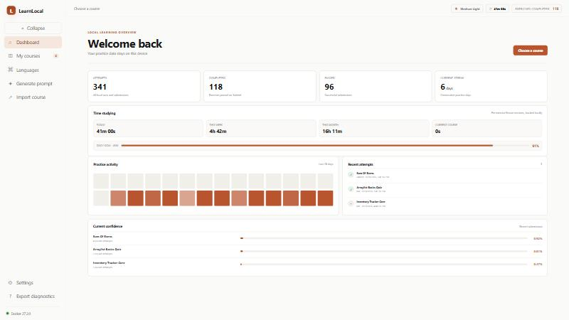
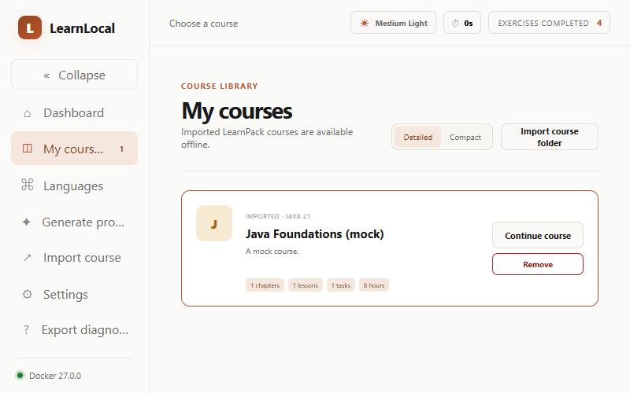
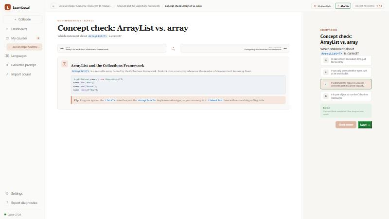
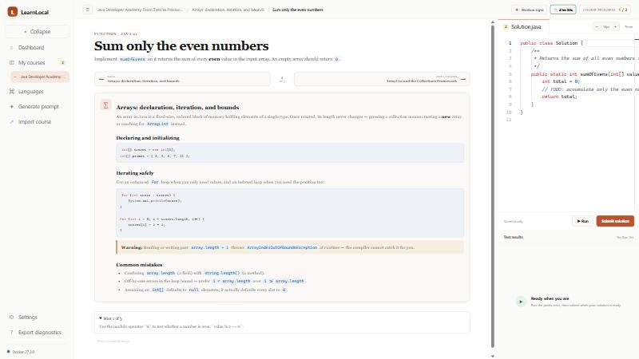
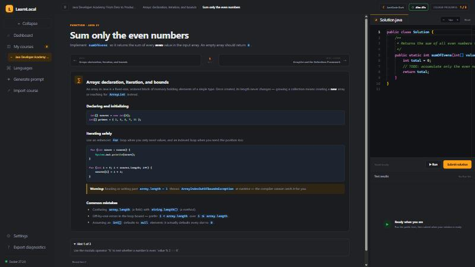
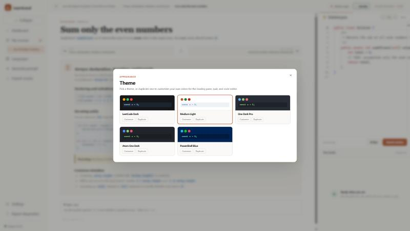

# LearnLocal

**Programming education for anyone, regardless of internet access or budget.**

LearnLocal is an offline-first desktop application for learning to code. Import a course once, and everything after that — reading lessons, taking quizzes, writing and running real code, tracking your progress — works completely offline, with no account, no subscription, and no data ever leaving your machine.

## Why LearnLocal exists

Most modern ways to learn programming — interactive platforms, video subscriptions, cloud IDEs — assume you have fast, affordable, always-on internet and can pay a recurring fee. That assumption doesn't hold everywhere. LearnLocal is built for:

- **Learners with unreliable or expensive internet** — download a course once (or get it from someone who already has it, on a USB drive if needed), and learn entirely offline from then on.
- **Learners who can't justify a monthly subscription** — LearnLocal itself is free and requires no account. Courses are portable files you own, not a rented catalog.
- **Anyone who wants their code and progress to stay on their own machine** — nothing is uploaded anywhere. Ever.

Today, LearnLocal ships with trusted, sandboxed **Java 21** execution and a complete, ready-to-import Java curriculum (25 chapters, from first compile to Spring Boot and distributed systems). Support for more languages is planned — course *content* for any language can already be imported and studied today, it just runs in read-only "study mode" until a trusted execution adapter for that language ships.

## A tour of the app

| | |
|---|---|
|  **Dashboard** — attempts, streaks, and time studied today/this week/this month, with a per-chapter breakdown. |  **My Courses** — imported courses with a Detailed or Compact view. |
|  **Concept checks** — multiple-choice quizzes woven into lessons, with instant feedback. |  **Lesson + editor** — reading pane and Monaco code editor side by side, both syntax-highlighted from the same theme. |
|  **Built-in dark theme** — LeetCode-inspired, for a coding-tool feel. |  **Theme picker** — pick a built-in theme or duplicate one to design your own. |

*(All screenshots above are from the default Medium Light theme unless noted.)*

## Feature overview

**Learning experience**
- Reading lessons, typed exercises (function, debug, output, multi-file project checkpoints), and multiple-choice concept checks, all in one continuous course flow with a "Next" step after every correct answer or passing submission.
- A 75/25 reading-pane/editor split by default, resizable and remembered.
- A "Course topics" modal for jumping between lessons and milestone projects without leaving the workspace.
- Progressive hints with a configurable reveal delay.
- Public tests for **Run**, hidden tests for **Submit**, normalized pass/fail results, and bounded execution time/memory/output.

**Time tracking & progress**
- A live study timer that counts your time today without resetting when you switch lessons.
- Per-course and per-chapter time breakdowns, a daily study goal with progress, attempts/streak/confidence stats — all computed locally from raw session data, never estimated.

**Appearance**
- Five built-in themes (LeetCode Dark, Medium Light, One Dark Pro, Atom One Dark, PowerShell Blue), each with a matching real syntax-highlighting palette shared by the Monaco editor *and* the reading pane's code blocks — not just chrome colors.
- Duplicate any theme and customize every color (backgrounds, text, accent, status colors, code syntax) with a live preview, saved as your own theme.
- Adjustable editor font size with quick +/− controls.

**Course content**
- Import a course by pointing at its folder directly — no archive format to trust, validated against the LearnPack 1.0 schema (path traversal, symlink, and size-limit checks included).
- Author a course with any AI assistant using the built-in prompt generator (language + topics + your own description), then scaffold and import the result.
- Arbitrary-language course content is always importable for reading and quizzes; trusted code execution is available wherever a reviewed adapter exists (Java 21 today).

**Runtime management**
- Independent install/verify/update/remove for the Java runtime, with live `docker pull` progress shown instead of a silent spinner.
- Offered automatically the first time you open a course that needs it — dismissible, so you can keep reading before installing anything.

**Privacy & security**
- No account, no telemetry, no network calls except pulling the approved, digest-pinned Docker image you explicitly install.
- Code runs in a fresh, disposable, network-disabled container per attempt — no container is ever kept running, and none are created just by installing or browsing.
- Strict Electron sandboxing: no Node or raw IPC access from the renderer, validated IPC payloads, CSP, navigation guards.

**Everything else**
- Local SQLite storage for attempts, workspaces, settings, prompt templates/history, custom themes, and time tracking, with versioned migrations and automatic backup-before-migration.
- Global settings (editor font size, hint delay, runtime auto-install offer, daily study goal, timer visibility) — one place, no per-course overrides to manage.
- A diagnostics export that bundles application/platform info, Docker status, database health, learning and time-tracking summaries, imported course list, current settings, and appearance state into one JSON file for troubleshooting.
- Cross-platform packaging (Windows/macOS/Linux) and CI.

## Prerequisites

- Node.js 22+
- Docker Desktop or Docker Engine (only needed to *run* code — reading courses and quizzes work without it)

## Development

```bash
npm install
npm run dev
```

**Run** executes public tests, while **Submit** also executes hidden tests. Each compile and test run uses a restricted, disposable container built from an approved digest-pinned image. The normal execution path opens no TCP port.

## Checks

```bash
npm run check
```

The first Docker execution may take longer while the pinned Java image is downloaded.

Run the real-container conformance suite after runner or sandbox changes:

```powershell
$env:RUN_DOCKER_TESTS='1'
npx vitest run packages/sandbox-docker/src/docker.integration.test.ts
```

## Packaging

```bash
npm run pack   # unpacked application for local validation
npm run dist   # platform installer
```

Installer output is written to `release/`. The manual packaging workflow builds Windows, macOS, and Linux artifacts. Public trusted releases still require repository-owner signing credentials and an update distribution endpoint.

## Course content

The repository includes a small canonical import fixture at `learnpack-spec/examples/java-foundations/` and a full Java 21 developer academy under `examples/javaCourse/`. The academy contains 25 chapters, 152 sequential lessons, 208 knowledge checks and executable labs, five cumulative portfolio phases, and a production-minded capstone. It progresses from first compilation through the JVM, language fundamentals, algorithms, object design, testing, builds, concurrency, networking, SQL/JDBC, architecture, security, Spring/JPA, distributed systems, and operations.

Every file under `examples/javaCourse/` is independently authored curriculum and is the source of truth: `content/` holds the chapter structure and exercises, `lessons/` holds each lesson's long-form Markdown theory (referenced from the chapter JSON by `theoryFile`), and `projects/` holds the portfolio phases. There is no curriculum-content generator. The pack distinguishes runnable standard-library exercises from external database/framework/deployment work and reviewer-assessed portfolio requirements. Checkpoints test behavior; they do not certify professional mastery.

**Importing a course**: in the app, click **Import course** and select a course's folder directly (for example `examples/javaCourse/`) — LearnLocal validates it against the LearnPack 1.0 schema on import. There is no archive/zip step; importing a folder directly is a deliberate security choice (a zip renamed to a custom extension is not a meaningful trust boundary).

A packaged `javaCourse.learnpack` archive can still be built at the repository root with `npm run curriculum:package` for distribution or backup — it's a plain zip of the same source files, rebuilt with `node scripts/verify-java-curriculum.mjs`, which checks instructor reference solutions for all function labs, debug repairs, and project cases against the locally available Java 21 Docker image. Instructor fixtures are excluded from the pack. This verifies those cases, not every illustrative snippet or external framework integration.

To author a course with any AI assistant, open **Generate prompt** in the app: choose the target language, optionally list topics to include, and describe what you want to learn or build. The AI infers the remaining course and runtime metadata and produces every LearnPack file in one response. Save the manifest, let LearnLocal scaffold its referenced paths, paste each JSON block into place, and import the folder — see the [LearnPack authoring guide](docs/learnpack-authoring.md) for the full format.
